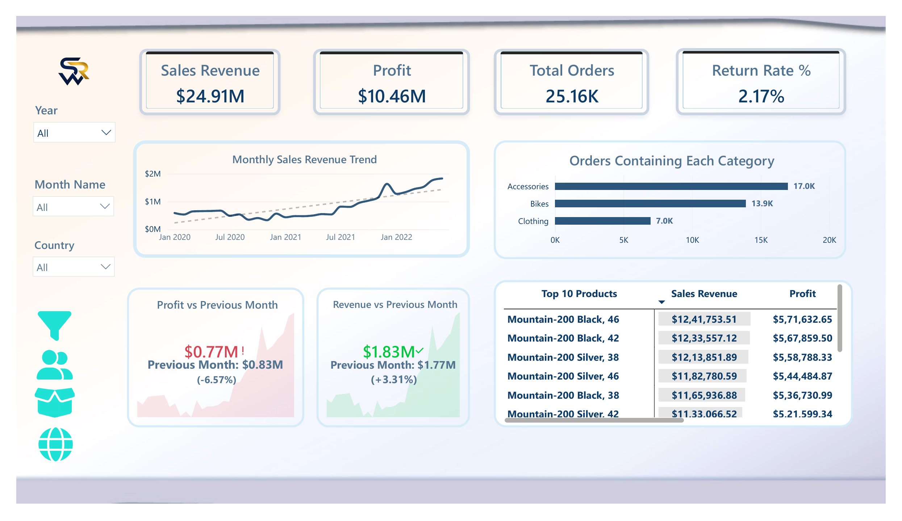

# Sales Analytics Dashboard

## Project Overview

This Power BI dashboard analyzes bicycle, accessories, and clothing sales data. It covers sales revenue, profit, orders, returns, customer behavior, product performance, monthly trends, and regional performance.

## Tools Used

- Power BI
- Power Query
- DAX
- Excel

## Key KPIs

- Sales Revenue
- Profit
- Total Orders
- Return Rate
- Total Customers
- Products Sold
- Total Units
- Total Return Units

## Dashboard Pages

1. Executive Summary
2. Primary Dashboard
3. Customers Detail
4. Products Detail
5. Region Analysis

## Key Insights

- $24.91M sales revenue and $10.46M profit
- 25.16K orders from 17.42K customers
- Bikes contributed 94.9% of total revenue
- United States generated the highest revenue
- Bike return rate requires attention
- Monthly revenue trend shows overall growth

## Dashboard Preview

## Project Files

- `Sales Analytics Dashboard.pbix`
- `Sales Analytics Dashboard.pdf`

## Live Report

Live Power BI report link will be added here.

## Author

**Rayarao Sai Krishna**
